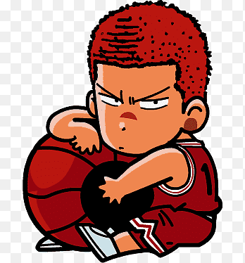

<a name="readme-top">

<br/>

<br />
<div align="center">
  <a href="https://github.com/cheytac2025/">
  <!-- TODO: If you want to add logo or banner you can add it here -->
    
  </a>
<!-- TODO: Change Title to the name of the title of your Project -->
  <h3 align="WD-Seatwork-1">WD-Finals</h3>
</div>
<!-- TODO: Make a short description -->
<div align="center">
WD-Finals - A portfolio is a personal website that showcases your skills, projects, and achievements. It reflects your personality, highlights your best work, and helps potential employers or collaborators understand what you can do. A good portfolio includes an About Me section, education, sample projects, and contact details.
</div>

<br />

<!-- TODO: Change the zyx-0314 into your github username  -->
<!-- TODO: Change the WD-Template-Project into the same name of your folder -->


---

<br />
<br />

<!-- TODO: If you want to add more layers for your readme -->
<details>
  <summary>Table of Contents</summary>
  <ol>
    <li>
      <a href="#overview">Overview</a>
      <ol>
        <li>
          <a href="#key-components">Key Components</a>
        </li>
        <li>
          <a href="#technology">Technology</a>
        </li>
      </ol>
    </li>
    <li>
      <a href="#rule,-practices-and-principles">Rules, Practices and Principles</a>
    </li>
    <li>
      <a href="#resources">Resources</a>
    </li>
  </ol>
</details>

---

## Overview

WD-Finals - A portfolio is a personal website that showcases your skills, projects, and achievements. It reflects your personality, highlights your best work, and helps potential employers or collaborators understand what you can do. A good portfolio includes an About Me section, education, sample projects, and contact details.

✨ Key Features:
About Me Section – A brief introduction that highlights your background, interests, and goals.

Skills & Technologies – A list of your technical abilities, tools, and programming languages.

Projects Gallery – Showcases your best works with descriptions and links to live demos or GitHub.

Responsive Design – Looks great on all devices (mobile, tablet, desktop).

Contact Information – Easy ways for visitors to reach you via email, phone, or social media.

Clean and Consistent Layout – Easy-to-navigate structure with a modern design.

Downloadable Resume (optional) – Lets recruiters quickly access your full credentials.

Dark/Light Theme (optional) – A toggle for users to choose their preferred viewing mode.

🚀 Technologies Used:
HTML5

CSS3

📂 Purpose:
The purpose of this portfolio is to showcase my skills, projects, and experience as a BSIT-CST student. It serves as a digital resume that reflects my passion for technology and my goal of contributing to the field, whether through industry work or public service.

### Key Components
<!-- TODO: List of Key Components -->
<!-- The following are just sample -->
-Header & Navigation – Easy access to all main sections.
-About Me – Brief intro, background, and career goals.
-Education – Academic background and achievements.
-Projects – Highlights of your best work with descriptions.
-Skills – Tools, languages, and technologies you’re proficient in.
-Contact Information – Ways to reach you (email, phone, links).

Footer – Copyright, navigation links, and optional social media.

### Technology
<!-- TODO: List of Technology Used -->


## Rules, Practices and Principles
1. Always use `WD-` in the front of the Title of the Project for the Subject followed by your custom naming.
2. Do not rename any .html files; always use `index.html` as the filename.
3. Place Files in their respective folders.
4. All file naming are in camel case.
   - Camel case is naming format where there is no white space in separation of each words, the first word is in all lower case while the succeding words first letter are in upper followed by lower cased letters.
   - ex.: buttonAnimatedStyle.css
5. Use only `External CSS`.
6. Renaming of Pages folder names are a must, and relates to what it is doing or data it holding.
7. File Structure to follow below.

```
WD-ProjectName
└─ assets
|   └─ css
|   |   └─ style.css
|   └─ img
|   |   └─ fileWith.jpeg/.jpg/.webp/.png
|   └─ js
|       └─ script.js
└─ pages
|  └─ pageName
|     └─ assets
|     |  └─ css
|     |  |  └─ style.css
|     |  └─ img
|     |  |  └─ fileWith.jpeg/.jpg/.webp/.png
|     |  └─ js
|     |     └─ script.js
|     └─ index.html
└─ index.html
└─ readme.md
```

## Resources

| Title | Purpose | Link |
|-------|---------|------|
| Credly | Used to showcase certificates. | [Visit](https://www.credly.com/users/karl-emmanuel-robles/badges#credly) |
| Github | Used to get the previous projecs and For version control and repository hosting.. | [Visit](https://www.pinterest.com/pin/dob-desktop-mobile-wireframe-ui-kit-wireframe-kits--84020349290680719/) |

